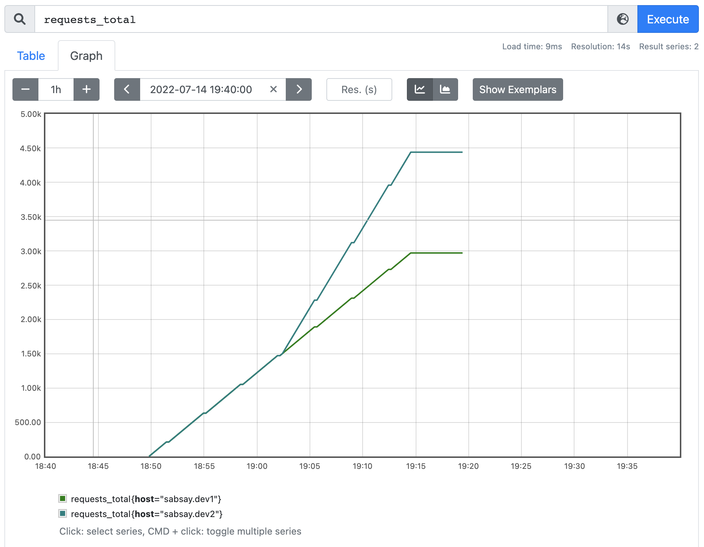
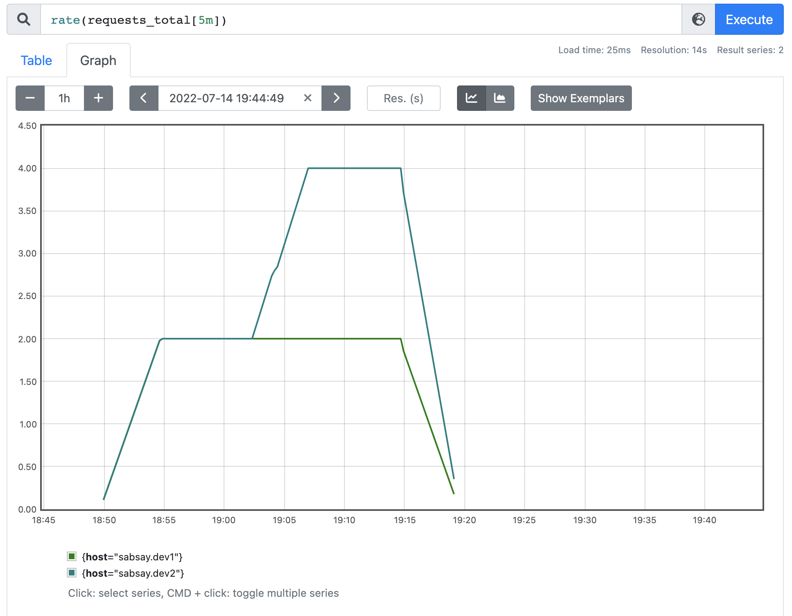
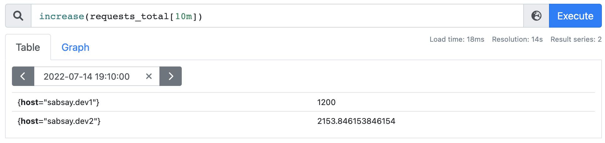
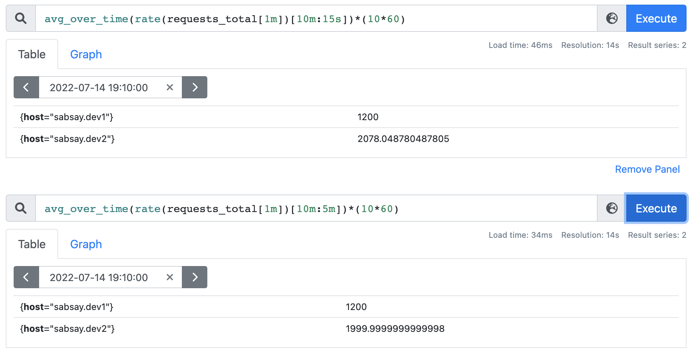

# Prometheus Rates and Counters

## Question

Is it possible to calculate the original count from a rate metric?

In other words, can one get the equivalent of `increase(some_metric[1d])` by using the output of a recording rule like `rate(some_metric[5m])`?

## Why?

The way PromQL handles counter resets means that `rate()` must always be used _before_ aggregation.
When computing high-level metrics like service-level indicators (SLIs), aggregation is necessary.

It's common to evaluate SLIs over different time periods (e.g. alert based on last 10m, but report a 30d average to management).
We can of course use multiple recording rules to account for different time periods, like:

    rate(some_metric[10m])
    rate(some_metric[30d])

However, this means that for each time period, we must go back to the original counter metrics, which may be quite slow and expensive to query.
Recording rules are the solution to problematically slow queries.
But can we use them in this scenario?

## Answer

Based on the experiment below, it appears this is not possible.
While results may be close in some situations,
the duration used in the `rate()` recording rule and the nature of the underlying counter will affect how accurate it is.

## Explanation

To test this, I created some artificial time series and loaded them into PromQL with promtool:

The series `requests_total{host="sabsay.dev1"}` is a counter that increases at a constant rate of 120 per minute (2 per second).
The series `requests_total{host="sabsay.dev2"}` is a counter that increases at a constant rate of 2 per second for 50 samples and then increases at twice that rate for the next 50 samples.

Here is what their rates look like:

For the purposes of reporting on some SLI/SLO, imagine we want to report how many requests were served in the last 10min, ending at some fixed time.

> In reality, larger time ranges than 10m are usually used, but this is a demonstration.

Working with the raw counters, this is easy:

If we use rates, by embedding a `rate()` inside our expression (as if we were using the output of a recording rule),
it works only for the constant-rate counter, but not the other one:

Interestingly, changing the `rate()` duration brings it closer to the expected value, but still not perfect:

Since the `rate()` duration changes the accuracy, I suspect that counters with rapidly changing rates are more affected by this than others.
